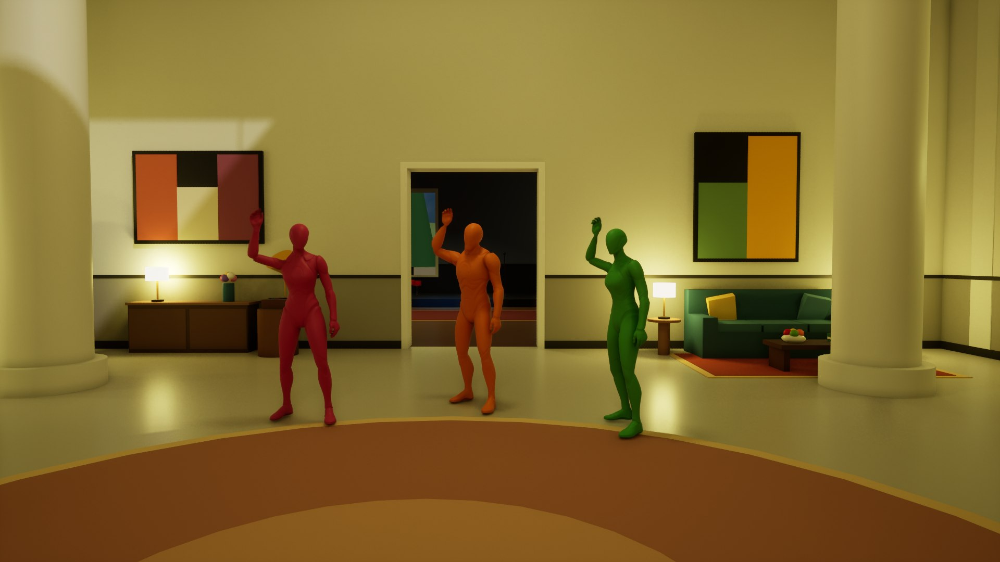

# Pipecat Room



Walk around a house and talk to the three people who live there: Maya (a
botanist, in the conservatory), Theo (a chef, in the kitchen) and Juno (a
musician, in the music room). It's a [Pipecat](https://github.com/pipecat-ai/pipecat)
voice agent in an Unreal Engine game: one conversation, three characters, each
with their own voice, coming from where they stand. Only those close enough hear
you.

## Requirements

- Windows (x86_64) with a ray tracing GPU (best on NVIDIA RTX).
- Unreal Engine 5.8.
- Visual Studio (or its Build Tools) with "Desktop development with C++",
  "C++ CMake tools for Windows" and the ".NET Framework 4.8 SDK".
- The [Pipecat C++ client](https://github.com/pipecat-ai/pipecat-client-cxx)
  source.
- [uv](https://docs.astral.sh/uv/), and WSL for the bot (`wsl --install`).
- API keys: OpenAI, Cartesia, Deepgram, Jev (TypeSafe) and Daily.
- A microphone. Headphones are best.
- Optional: NVIDIA's DLSS 4.5 plugin for UE 5.8 (unzip `DLSS` and `Streamline*`
  into `Plugins/`). Without it, the game uses TSR.

## Build

In PowerShell, from this directory:

```
$env:UE_ROOT = "C:\Program Files\Epic Games\UE_5.8"
$env:PIPECAT_CLIENT_CXX = "C:\path\to\pipecat-client-cxx"
.\Plugins\Pipecat\ThirdParty\build-windows.ps1
& "$env:UE_ROOT\Engine\Build\BatchFiles\Build.bat" PipecatRoomEditor Win64 Development -Project="$PWD\PipecatRoom.uproject"
.\setup.ps1
```

`build-windows.ps1` builds the client and its Daily and WebSocket transports
(downloading Daily's Core SDK the first time). `setup.ps1` copies Unreal's Third
Person template content and creates the game's materials.

## Run

1. Start the bot:

   ```
   cd bot
   copy env.example .env   # then add your API keys
   wsl bash ./run-wsl.sh
   ```

   Without WSL, run `uv run bot.py -t websocket` and start the game with
   `-PipecatTransport=websocket`.

2. Start the game:

   ```
   & "$env:UE_ROOT\Engine\Binaries\Win64\UnrealEditor.exe" "$PWD\PipecatRoom.uproject" -game
   ```

Walk with WASD and the mouse, or a controller. Find someone and say hello. Press
**E** (X on Xbox, square on DualSense) to use what's near you: the gramophone,
the piano, the dinner bell, the cake, the flowers, the fountain, the sculptures,
or to give someone what you're holding.

Things to say: "follow me", "wait here", "let's meet in the gallery", "go back to
what you were doing", "can you introduce me to Juno?", "could I have some cake?",
"pick me a flower", "put a record on", "who wants to dance?".

## Options

- `-PipecatStartUrl=URL`: the bot's start endpoint (default
  `http://localhost:7860/start`).
- `-PipecatMicrophone=NAME`: the microphone to use, by part of its name.
- `-PipecatNoMicrophone -PipecatSay="Hello?"`: try it without speaking.
- `-PipecatNoLogo`: skip the logo.

`Config/DefaultGame.ini` has the voice and hearing distances. `bot/characters.json`
and `bot/prompts/` define the characters. To use PhoneLLM instead of OpenAI, set
`PHONELLM_API_KEY`, `PHONELLM_BASE_URL` and `LLM_MODEL` in `bot/.env`.

## Checks

```
cd bot
uv run ruff check . ; uv run pyright ; uv run pytest -q
```

## License

BSD 2-Clause: see [LICENSE](LICENSE).
